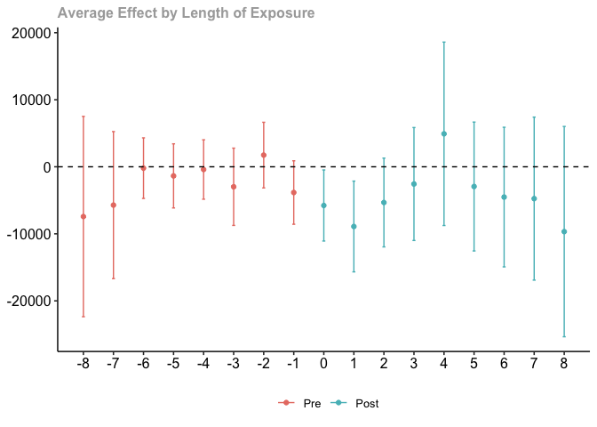
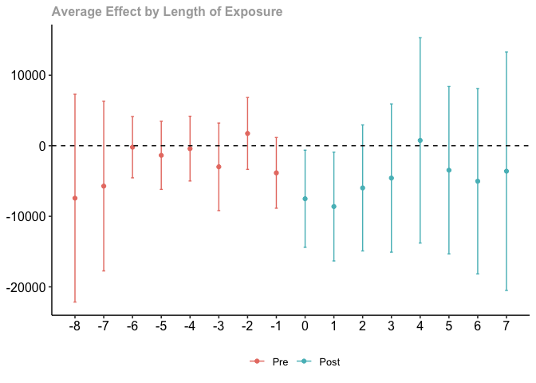
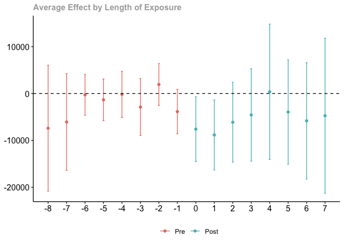
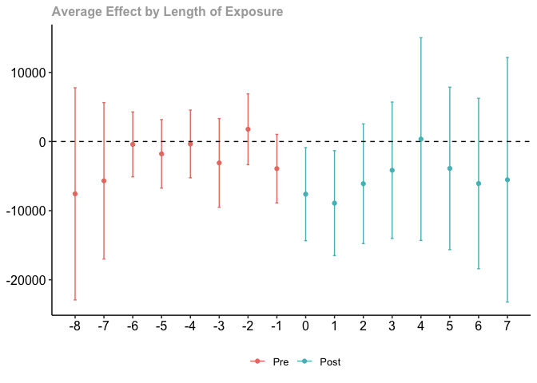

# Exercise 1 Solutions

This exercise will involve estimating causal effect parameters using a
difference-in-differences identification strategy that involves
conditioning on covariates in the parallel trends assumption and
possibly allows for anticipation effects.

In particular, we will use data from the National Longitudinal Study of
Youth to learn about causal effects of job displacement (where job
displacement roughly means “losing your job through no fault of your
own” — a mass layoff is a main example).

To start with, load the data from the file `job_displacement_data.RData`
by running

``` r
load("job_displacement_data.RData")
```

which will load a `data.frame` called `job_displacement_data`. This is
what the data looks like

``` r
head(job_displacement_data)
```

           id year group income female white occ_score
    1 7900002 1984     0  31130      1     1         4
    2 7900002 1985     0  32200      1     1         3
    3 7900002 1986     0  35520      1     1         4
    4 7900002 1987     0  43600      1     1         4
    5 7900002 1988     0  39900      1     1         4
    6 7900002 1990     0  38200      1     1         4

You can see that the data contains the following columns:

-   `id` - an individual identifier
-   `year` - the year for this observation
-   `group` - the year that person lost his/her job. `group=0` for those
    that do not lose a job in any period being considered.
-   `income` - a person’s wage and salary income in this year
-   `female` - 1 for females, 0 for males
-   `white` - 1 for white, 0 for non-white

For the results below, we will mainly use the `did` package which you
can install using `install.packages("did")`, and you can load it using

``` r
library(did)
```

## Question 1

We will start by computing group-time average treatment effects without
including any covariates in the parallel trends assumption.

1)  Use the `did` package to compute all available group-time average
    treatment effects.

<details>
<summary>
Solutions:
</summary>

<div style="border-left: 2px solid black; padding-left: 1rem">

``` r
no_covs <- att_gt(yname="income",
                  tname="year",
                  idname="id",
                  gname="group",
                  data=job_displacement_data)
```

    Warning in pre_process_did(yname = yname, tname = tname, idname = idname, :
    Dropped 26 units that were already treated in the first period.

``` r
summary(no_covs)
```


    Call:
    att_gt(yname = "income", tname = "year", idname = "id", gname = "group", 
        data = job_displacement_data)

    Reference: Callaway, Brantly and Pedro H.C. Sant'Anna.  "Difference-in-Differences with Multiple Time Periods." Journal of Econometrics, Vol. 225, No. 2, pp. 200-230, 2021. <https://doi.org/10.1016/j.jeconom.2020.12.001>, <https://arxiv.org/abs/1803.09015> 

    Group-Time Average Treatment Effects:
     Group Time    ATT(g,t) Std. Error [95% Simult.  Conf. Band]  
      1985 1985  -9455.7583   3961.261   -19807.2131    895.6965  
      1985 1986 -14981.1547   4479.025   -26685.6169  -3276.6925 *
      1985 1987  -6129.2132   4152.801   -16981.1973   4722.7710  
      1985 1988  -4815.9179   4807.276   -17378.1569   7746.3211  
      1985 1990  -8011.9173   5801.764   -23172.9225   7149.0879  
      1985 1991  -8164.4924   5680.163   -23007.7357   6678.7510  
      1985 1992  -6325.8880   5748.257   -21347.0707   8695.2948  
      1985 1993  -9669.5840   5707.815   -24585.0842   5245.9162  
      1986 1985  -1801.9373   2314.261    -7849.4984   4245.6239  
      1986 1986  -1919.4474   3523.592   -11127.1988   7288.3040  
      1986 1987  -2596.8189   4716.608   -14922.1261   9728.4883  
      1986 1988  -2081.7535   7315.507   -21198.4300  17034.9231  
      1986 1990  -6064.0942   6787.640   -23801.3637  11673.1753  
      1986 1991  -5903.9636   7113.179   -24491.9224  12683.9952  
      1986 1992  -6804.4833   7602.591   -26671.3603  13062.3937  
      1986 1993  -1801.5755   7535.861   -21494.0745  17890.9235  
      1987 1985   4518.5745   5180.438    -9018.8015  18055.9504  
      1987 1986  -8012.4879   4356.395   -19396.4971   3371.5212  
      1987 1987   7048.8565   6719.662   -10510.7755  24608.4886  
      1987 1988   4489.4666   6592.467   -12737.7826  21716.7159  
      1987 1990   8004.1361   7176.929   -10750.4126  26758.6849  
      1987 1991   9475.0656   7691.792   -10624.9082  29575.0394  
      1987 1992   8533.5413  10364.632   -18551.0226  35618.1053  
      1987 1993   7881.3931   7955.840   -12908.5844  28671.3706  
      1988 1985  -8350.7706   4509.790   -20135.6267   3434.0854  
      1988 1986  -3420.8529   3735.453   -13182.2341   6340.5283  
      1988 1987  -3617.6742   3651.466   -13159.5825   5924.2341  
      1988 1988  -1173.8167   2933.495    -8839.5441   6491.9108  
      1988 1990    280.6263   5965.765   -15308.9420  15870.1946  
      1988 1991   6099.7271   4274.076    -5069.1689  17268.6231  
      1988 1992  13737.8166  13290.779   -20993.2731  48468.9063  
      1988 1993   1688.7819   8165.260   -19648.4452  23026.0090  
      1990 1985  -5281.5363   3424.113   -14229.3320   3666.2594  
      1990 1986   3654.1728   2540.486    -2984.5529  10292.8984  
      1990 1987   5934.8952   3246.517    -2548.8124  14418.6027  
      1990 1988   1034.1988   3165.491    -7237.7732   9306.1707  
      1990 1990  -4343.9488  12281.094   -36436.5577  27748.6602  
      1990 1991 -21910.2102   4662.617   -34094.4307  -9725.9896 *
      1990 1992 -15365.9271   3831.037   -25377.0847  -5354.7695 *
      1990 1993 -16411.1053   6158.087   -32503.2447   -318.9660 *
      1991 1985    891.2874   3636.180    -8610.6764  10393.2511  
      1991 1986  -2816.6357   3512.148   -11994.4827   6361.2113  
      1991 1987  -1340.0549   3226.257    -9770.8182   7090.7084  
      1991 1988  -7025.0387   3786.939   -16920.9601   2870.8827  
      1991 1990   2568.6223   6024.105   -13173.4003  18310.6450  
      1991 1991 -12150.6450   4162.714   -23028.5330  -1272.7570 *
      1991 1992   1433.9979   4489.699   -10298.3558  13166.3516  
      1991 1993  -2679.8275   6982.623   -20926.6219  15566.9669  
      1992 1985 -12110.0572   7199.653   -30923.9865   6703.8721  
      1992 1986  -3287.5606   2403.675    -9568.7763   2993.6550  
      1992 1987   2300.0285   3680.199    -7316.9644  11917.0213  
      1992 1988  -7273.9345   2752.947   -14467.8592    -80.0099 *
      1992 1990   7351.4926   4624.307    -4732.6175  19435.6028  
      1992 1991 -10031.7028   7578.225   -29834.9081   9771.5025  
      1992 1992  -8990.8504   4382.811   -20443.8898   2462.1889  
      1992 1993  -8662.6119  14827.854   -47410.3441  30085.1204  
      1993 1985  -7424.6641   5254.304   -21155.0641   6305.7358  
      1993 1986    677.9060   3335.258    -8037.6960   9393.5080  
      1993 1987   1424.1385   3929.295    -8843.7840  11692.0609  
      1993 1988   4778.2556   1819.141       24.5275   9531.9836 *
      1993 1990  -3797.3928   4318.336   -15081.9475   7487.1619  
      1993 1991   3664.8825   6484.749   -13280.8815  20610.6465  
      1993 1992  -4108.9169   5665.558   -18913.9925  10696.1588  
      1993 1993 -22828.3617   6593.199   -40057.5237  -5599.1997 *
    ---
    Signif. codes: `*' confidence band does not cover 0

    P-value for pre-test of parallel trends assumption:  0
    Control Group:  Never Treated,  Anticipation Periods:  0
    Estimation Method:  Doubly Robust

</div>

</details>

2)  *Bonus Question* Try to manually calculate $ATT(g=1992, t=1992)$.
    Can you calculate exactly the same number as in part (a)?

<details>
<summary>
Solutions:
</summary>

<div style="border-left: 2px solid black; padding-left: 1rem">

``` r
  mean(subset(job_displacement_data, group==1992 & year==1992)$income) -
    mean(subset(job_displacement_data, group==1992 & year==1991)$income) - 
    ( mean(subset(job_displacement_data, group==0 & year==1992)$income) -
    mean(subset(job_displacement_data, group==0 & year==1991)$income) )
```

    [1] -8990.85

</div>

</details>

3)  Aggregate the group-time average treatment effects into an event
    study and plot the results. What do you notice? Is there evidence
    against parallel trends?

<details>
<summary>
Solutions:
</summary>

<div style="border-left: 2px solid black; padding-left: 1rem">

``` r
  no_covs_es <- aggte(no_covs, type="dynamic")
  ggdid(no_covs_es)
```



</div>

</details>

4)  Aggregate the group-time average treatment effects into a single
    overall treatment effect. How do you interpret the results?

<details>
<summary>
Solutions:
</summary>

<div style="border-left: 2px solid black; padding-left: 1rem">

``` r
  no_covs_overall <- aggte(no_covs, type="group")
  summary(no_covs_overall)
```


    Call:
    aggte(MP = no_covs, type = "group")

    Reference: Callaway, Brantly and Pedro H.C. Sant'Anna.  "Difference-in-Differences with Multiple Time Periods." Journal of Econometrics, Vol. 225, No. 2, pp. 200-230, 2021. <https://doi.org/10.1016/j.jeconom.2020.12.001>, <https://arxiv.org/abs/1803.09015> 


    Overall summary of ATT's based on group/cohort aggregation:  
           ATT    Std. Error     [ 95%  Conf. Int.]  
     -5631.049      2033.416  -9616.471   -1645.626 *


    Group Effects:
     Group   Estimate Std. Error [95% Simult.  Conf. Band]  
      1985  -8444.241   4790.032    -19907.157    3018.676  
      1986  -3881.734   6169.047    -18644.740   10881.272  
      1987   7572.077   6314.226     -7538.354   22682.507  
      1988   4126.627   4696.961     -7113.563   15366.817  
      1990 -14507.798   4419.427    -25083.828   -3931.768 *
      1991  -4465.492   4684.697    -15676.332    6745.349  
      1992  -8826.731   8354.767    -28820.333   11166.871  
      1993 -22828.362   6706.660    -38877.917   -6778.806 *
    ---
    Signif. codes: `*' confidence band does not cover 0

    Control Group:  Never Treated,  Anticipation Periods:  0
    Estimation Method:  Doubly Robust

</div>

</details>

# Question 2

A major issue in the job displacement literature concerns a version of
anticipation. In particular, there is some empirical evidence that
earnings of displaced workers start to decline *before* they are
actually displaced (a rough explanation is that firms where there are
mass layoffs typically “struggle” in the time period before the mass
layoff actually takes place and this can lead to slower income growth
for workers at those firms).

1)  Is there evidence of anticipation in your results from Question 1?

<details>
<summary>
Solutions:
</summary>

<div style="border-left: 2px solid black; padding-left: 1rem">

There is a moderate amount of evidence for anticipation in the previous
results. It hinges on the estimate for event-time equal to -1. It is
negative which is in line with the discussion about anticipation above,
but it is only marginally statistically significant.

</div>

</details>

2)  Repeat parts (a)-(d) of Question 1 allowing for one year of
    anticipation.

<details>
<summary>
Solutions:
</summary>

<div style="border-left: 2px solid black; padding-left: 1rem">

``` r
  # part a
  ant_res <- att_gt(yname="income",
                    tname="year",
                    idname="id",
                    gname="group",
                    data=job_displacement_data,
                    anticipation=1)
```

    Warning in pre_process_did(yname = yname, tname = tname, idname = idname, :
    Dropped 26 units that were already treated in the first period.

``` r
  summary(ant_res)
```


    Call:
    att_gt(yname = "income", tname = "year", idname = "id", gname = "group", 
        data = job_displacement_data, anticipation = 1)

    Reference: Callaway, Brantly and Pedro H.C. Sant'Anna.  "Difference-in-Differences with Multiple Time Periods." Journal of Econometrics, Vol. 225, No. 2, pp. 200-230, 2021. <https://doi.org/10.1016/j.jeconom.2020.12.001>, <https://arxiv.org/abs/1803.09015> 

    Group-Time Average Treatment Effects:
     Group Time    ATT(g,t) Std. Error [95% Simult.  Conf. Band]  
      1986 1985  -1801.9373   2554.911    -8317.9099   4714.0354  
      1986 1986  -3721.3846   3470.872   -12573.3968   5130.6275  
      1986 1987  -4398.7562   4055.044   -14740.6248   5943.1124  
      1986 1988  -3883.6907   6609.463   -20740.2764  12972.8949  
      1986 1990  -7866.0314   6155.638   -23565.1942   7833.1314  
      1986 1991  -7705.9009   6543.008   -24393.0026   8981.2009  
      1986 1992  -8606.4205   7212.652   -27001.3619   9788.5209  
      1986 1993  -3603.5128   6495.027   -20168.2444  12961.2189  
      1987 1985   4518.5745   5074.155    -8422.4065  17459.5555  
      1987 1986  -8012.4879   4336.893   -19073.1773   3048.2014  
      1987 1987   -963.6314   6704.556   -18062.7411  16135.4783  
      1987 1988  -3523.0213   7565.070   -22816.7605  15770.7179  
      1987 1990     -8.3518   6603.888   -16850.7190  16834.0153  
      1987 1991   1462.5776   7899.926   -18685.1699  21610.3252  
      1987 1992    521.0534   9909.853   -24752.7537  25794.8605  
      1987 1993   -131.0948   7533.657   -19344.7183  19082.5286  
      1988 1985  -8350.7706   4583.134   -20039.4644   3337.9231  
      1988 1986  -3420.8529   3678.890   -12803.3898   5961.6840  
      1988 1987  -3617.6742   3679.360   -13001.4083   5766.0599  
      1988 1988  -4791.4908   4495.390   -16256.4048   6673.4231  
      1988 1990  -3337.0478   7633.481   -22805.2618  16131.1661  
      1988 1991   2482.0529   5980.293   -12769.9173  17734.0232  
      1988 1992  10120.1424  15414.515   -29192.5983  49432.8832  
      1988 1993  -1928.8923   7523.509   -21116.6347  17258.8501  
      1990 1985  -5281.5363   3382.839   -13909.0334   3345.9608  
      1990 1986   3654.1728   2325.045    -2275.5565   9583.9020  
      1990 1987   5934.8952   3051.250    -1846.9266  13716.7169  
      1990 1988   1034.1988   3286.950    -7348.7448   9417.1423  
      1990 1990  -4343.9488  12018.477   -34995.5301  26307.6325  
      1990 1991 -21910.2102   4529.507   -33462.1372 -10358.2831 *
      1990 1992 -15365.9271   3767.603   -24974.7143  -5757.1400 *
      1990 1993 -16411.1053   6269.724   -32401.2313   -420.9794 *
      1991 1985    891.2874   3525.606    -8100.3186   9882.8934  
      1991 1986  -2816.6357   3571.142   -11924.3744   6291.1031  
      1991 1987  -1340.0549   3187.997    -9470.6326   6790.5228  
      1991 1988  -7025.0387   3687.265   -16428.9347   2378.8573  
      1991 1990   2568.6223   6006.146   -12749.2826  17886.5273  
      1991 1991  -9582.0227   8701.643   -31774.4462  12610.4009  
      1991 1992   4002.6202   7845.973   -16007.5260  24012.7664  
      1991 1993   -111.2052   9671.565   -24777.2895  24554.8792  
      1992 1985 -12110.0572   6812.399   -29484.2050   5264.0906  
      1992 1986  -3287.5606   2539.573    -9764.4141   3189.2929  
      1992 1987   2300.0285   3670.376    -7060.7929  11660.8498  
      1992 1988  -7273.9345   2875.412   -14607.3032     59.4341  
      1992 1990   7351.4926   4572.930    -4311.1779  19014.1631  
      1992 1991 -10031.7028   6841.675   -27480.5163   7417.1107  
      1992 1992 -19022.5532   6771.762   -36293.0613  -1752.0451 *
      1992 1993 -18694.3146   8131.448   -39432.5287   2043.8994  
      1993 1985  -7424.6641   4897.512   -19915.1383   5065.8100  
      1993 1986    677.9060   3262.148    -7641.7847   8997.5967  
      1993 1987   1424.1385   3785.024    -8229.0780  11077.3550  
      1993 1988   4778.2556   1590.412      722.1141   8834.3970 *
      1993 1990  -3797.3928   3958.428   -13892.8543   6298.0687  
      1993 1991   3664.8825   6470.397   -12837.0337  20166.7987  
      1993 1992  -4108.9169   5549.335   -18261.7839  10043.9502  
      1993 1993 -26937.2785   5326.389   -40521.5502 -13353.0069 *
    ---
    Signif. codes: `*' confidence band does not cover 0

    P-value for pre-test of parallel trends assumption:  0
    Control Group:  Never Treated,  Anticipation Periods:  1
    Estimation Method:  Doubly Robust

``` r
  # part b
  mean(subset(job_displacement_data, group==1992 & year==1992)$income) -
    mean(subset(job_displacement_data, group==1992 & year==1990)$income) - 
    ( mean(subset(job_displacement_data, group==0 & year==1992)$income) -
    mean(subset(job_displacement_data, group==0 & year==1990)$income) )
```

    [1] -19022.55

``` r
  # part c
  ant_es <- aggte(ant_res, type="dynamic")
  ggdid(ant_es)
```



``` r
  # part d
  ant_overall <- aggte(ant_res, type="group")
  summary(ant_overall)
```


    Call:
    aggte(MP = ant_res, type = "group")

    Reference: Callaway, Brantly and Pedro H.C. Sant'Anna.  "Difference-in-Differences with Multiple Time Periods." Journal of Econometrics, Vol. 225, No. 2, pp. 200-230, 2021. <https://doi.org/10.1016/j.jeconom.2020.12.001>, <https://arxiv.org/abs/1803.09015> 


    Overall summary of ATT's based on group/cohort aggregation:  
           ATT    Std. Error     [ 95%  Conf. Int.]  
     -7711.634       2389.48  -12394.93   -3028.339 *


    Group Effects:
     Group    Estimate Std. Error [95% Simult.  Conf. Band]  
      1986  -5683.6710   5359.711     -17638.28    6270.937  
      1987   -440.4114   6463.955     -14857.99   13977.166  
      1988    508.9529   6091.823     -13078.60   14096.506  
      1990 -14507.7979   4396.145     -24313.21   -4702.382 *
      1991  -1896.8692   8012.609     -19768.65   15974.914  
      1992 -18858.4339   4490.935     -28875.27   -8841.595 *
      1993 -26937.2785   5591.461     -39408.80  -14465.761 *
    ---
    Signif. codes: `*' confidence band does not cover 0

    Control Group:  Never Treated,  Anticipation Periods:  1
    Estimation Method:  Doubly Robust

</div>

</details>

# Question 3

Now, let’s suppose that we think that parallel trends holds only after
we condition on a person sex and race (in reality, you could think of
including many other variables in the parallel trends assumption, but
let’s just keep it simple). In my view, I think allowing for
anticipation is desirable in this setting too, so let’s keep allowing
for one year of anticipation.

1)  Answer parts (a), (c), and (d) of Question 1 but including `sex` and
    `white` as covariates.

<details>
<summary>
Solutions:
</summary>

<div style="border-left: 2px solid black; padding-left: 1rem">

``` r
  # part a
  covs_res <- att_gt(yname="income",
                    tname="year",
                    idname="id",
                    gname="group",
                    data=job_displacement_data,
                    anticipation=1,
                    xformla=~female + white)
```

    Warning in pre_process_did(yname = yname, tname = tname, idname = idname, :
    Dropped 26 units that were already treated in the first period.

    Warning in pre_process_did(yname = yname, tname = tname, idname = idname, : Be aware that there are some small groups in your dataset.
      Check groups: 1992,1993.

``` r
  summary(covs_res)
```


    Call:
    att_gt(yname = "income", tname = "year", idname = "id", gname = "group", 
        xformla = ~female + white, data = job_displacement_data, 
        anticipation = 1)

    Reference: Callaway, Brantly and Pedro H.C. Sant'Anna.  "Difference-in-Differences with Multiple Time Periods." Journal of Econometrics, Vol. 225, No. 2, pp. 200-230, 2021. <https://doi.org/10.1016/j.jeconom.2020.12.001>, <https://arxiv.org/abs/1803.09015> 

    Group-Time Average Treatment Effects:
     Group Time    ATT(g,t) Std. Error [95% Simult.  Conf. Band]  
      1986 1985  -1724.0034   2507.496    -8135.6129   4687.6060  
      1986 1986  -4258.8672   3550.870   -13338.3578   4820.6235  
      1986 1987  -4861.6136   3851.251   -14709.1722   4985.9451  
      1986 1988  -4729.6121   6225.266   -20647.4719  11188.2478  
      1986 1990  -8685.9902   6117.952   -24329.4501   6957.4698  
      1986 1991  -8753.8554   6304.949   -24875.4634   7367.7525  
      1986 1992  -9530.3951   6928.159   -27245.5350   8184.7447  
      1986 1993  -4727.7652   6154.233   -20463.9953  11008.4650  
      1987 1985   4559.7049   5493.584    -9487.2613  18606.6710  
      1987 1986  -8337.6804   4524.854   -19907.6265   3232.2657  
      1987 1987  -1244.4854   6504.538   -17876.4376  15387.4668  
      1987 1988  -4009.1142   7758.533   -23847.5026  15829.2742  
      1987 1990   -483.2506   6560.113   -17257.3064  16290.8052  
      1987 1991    865.8558   7949.326   -19460.3853  21192.0969  
      1987 1992     -1.1369   9571.396   -24474.9719  24472.6982  
      1987 1993   -760.5834   7251.582   -19302.7083  17781.5415  
      1988 1985  -8427.9592   4514.580   -19971.6353   3115.7169  
      1988 1986  -3208.6634   3820.052   -12976.4470   6559.1203  
      1988 1987  -3540.3348   3782.805   -13212.8775   6132.2078  
      1988 1988  -4496.7178   4657.326   -16405.3905   7411.9550  
      1988 1990  -2886.2705   8007.701   -23361.7743  17589.2333  
      1988 1991   3026.1289   6291.678   -13061.5459  19113.8037  
      1988 1992  10422.7498  14769.069   -27341.4143  48186.9138  
      1988 1993  -1710.3233   7435.845   -20723.6064  17302.9599  
      1990 1985  -5423.4224   3571.002   -14554.3922   3707.5475  
      1990 1986   4124.3571   2669.310    -2701.0052  10949.7193  
      1990 1987   6034.5096   3163.010    -2053.2342  14122.2534  
      1990 1988   1473.8450   3510.757    -7503.0785  10450.7685  
      1990 1990  -4087.0904  12015.365   -34810.0980  26635.9172  
      1990 1991 -21451.7077   4860.446   -33879.7542  -9023.6611 *
      1990 1992 -15350.4684   3464.608   -24209.3897  -6491.5471 *
      1990 1993 -16489.8656   5968.521   -31751.2355  -1228.4958 *
      1991 1985    787.4357   3509.558    -8186.4215   9761.2928  
      1991 1986  -2463.7125   3563.401   -11575.2461   6647.8211  
      1991 1987  -1271.9440   3193.856    -9438.5591   6894.6711  
      1991 1988  -6698.7830   3971.512   -16853.8474   3456.2814  
      1991 1990   2753.4298   6108.823   -12866.6879  18373.5474  
      1991 1991  -9246.2829   8509.299   -31004.3616  12511.7958  
      1991 1992   4013.8999   8319.927   -17259.9594  25287.7592  
      1991 1993   -162.2495  10219.406   -26293.0324  25968.5334  
      1992 1985 -12170.1207   6758.854   -29452.3519   5112.1105  
      1992 1986  -3584.4939   2733.097   -10572.9600   3403.9723  
      1992 1987   2598.5246   3378.439    -6040.0658  11237.1150  
      1992 1988  -7330.9148   2845.101   -14605.7724    -56.0572 *
      1992 1990   7649.2124   4790.721    -4600.5484  19898.9731  
      1992 1991 -10130.9141   8079.015   -30788.7679  10526.9397  
      1992 1992 -19327.7970   7121.871   -37538.2544  -1117.3396 *
      1992 1993 -19410.4421   8783.108   -41868.6436   3047.7595  
      1993 1985  -7391.9287   4963.220   -20082.7666   5298.9093  
      1993 1986     50.7636   3516.757    -8941.5023   9043.0295  
      1993 1987   1618.3041   3680.539    -7792.7474  11029.3557  
      1993 1988   4453.4544   1712.969       73.4323   8833.4765 *
      1993 1990  -3630.4984   4480.465   -15086.9429   7825.9461  
      1993 1991   3439.7874   6535.204   -13270.5764  20150.1511  
      1993 1992  -4123.7577   5740.036   -18800.8945  10553.3792  
      1993 1993 -27304.4090   5744.164   -41992.1018 -12616.7163 *
    ---
    Signif. codes: `*' confidence band does not cover 0

    P-value for pre-test of parallel trends assumption:  0
    Control Group:  Never Treated,  Anticipation Periods:  1
    Estimation Method:  Doubly Robust

``` r
  # part c
  covs_es <- aggte(covs_res, type="dynamic")
  ggdid(covs_es)
```



``` r
  # part d
  covs_overall <- aggte(covs_res, type="group")
  summary(covs_overall)
```


    Call:
    aggte(MP = covs_res, type = "group")

    Reference: Callaway, Brantly and Pedro H.C. Sant'Anna.  "Difference-in-Differences with Multiple Time Periods." Journal of Econometrics, Vol. 225, No. 2, pp. 200-230, 2021. <https://doi.org/10.1016/j.jeconom.2020.12.001>, <https://arxiv.org/abs/1803.09015> 


    Overall summary of ATT's based on group/cohort aggregation:  
           ATT    Std. Error     [ 95%  Conf. Int.]  
     -7931.965      2285.107  -12410.69   -3453.237 *


    Group Effects:
     Group    Estimate Std. Error [95% Simult.  Conf. Band]  
      1986  -6506.8712   5312.857     -18337.09    5323.351  
      1987   -938.7858   6553.935     -15532.54   13654.965  
      1988    871.1134   6235.987     -13014.66   14756.885  
      1990 -14344.7830   4253.122     -23815.28   -4874.290 *
      1991  -1798.2108   8776.799     -21341.65   17745.226  
      1992 -19369.1196   4160.269     -28632.86  -10105.383 *
      1993 -27304.4090   5958.998     -40573.40  -14035.413 *
    ---
    Signif. codes: `*' confidence band does not cover 0

    Control Group:  Never Treated,  Anticipation Periods:  1
    Estimation Method:  Doubly Robust

</div>

</details>

2)  By default, the `did` package uses the doubly robust approach that
    we discussed during our session. How do the results change if you
    use a regression approach or propensity score re-weighting?

<details>
<summary>
Solutions:
</summary>

<div style="border-left: 2px solid black; padding-left: 1rem">

For simplicity, I am just going to show the overall results when using
the regression approach and the propensity score re-weighting approach.

``` r
  reg_res <- att_gt(yname="income",
                    tname="year",
                    idname="id",
                    gname="group",
                    data=job_displacement_data,
                    anticipation=1,
                    xformla=~female + white,
                    est_method="reg")
```

    Warning in pre_process_did(yname = yname, tname = tname, idname = idname, :
    Dropped 26 units that were already treated in the first period.

    Warning in pre_process_did(yname = yname, tname = tname, idname = idname, : Be aware that there are some small groups in your dataset.
      Check groups: 1992,1993.

``` r
  summary(aggte(reg_res, type="group"))
```


    Call:
    aggte(MP = reg_res, type = "group")

    Reference: Callaway, Brantly and Pedro H.C. Sant'Anna.  "Difference-in-Differences with Multiple Time Periods." Journal of Econometrics, Vol. 225, No. 2, pp. 200-230, 2021. <https://doi.org/10.1016/j.jeconom.2020.12.001>, <https://arxiv.org/abs/1803.09015> 


    Overall summary of ATT's based on group/cohort aggregation:  
           ATT    Std. Error     [ 95%  Conf. Int.]  
     -7919.691      2113.461     -12062   -3777.383 *


    Group Effects:
     Group    Estimate Std. Error [95% Simult.  Conf. Band]  
      1986  -6434.0559   5504.932     -18863.04    5994.932  
      1987   -912.7508   7006.007     -16730.85   14905.351  
      1988    862.1890   6102.506     -12916.00   14640.376  
      1990 -14343.8838   4465.760     -24426.64   -4261.129 *
      1991  -1796.2167   8554.531     -21110.56   17518.130  
      1992 -19441.0738   4259.595     -29058.35   -9823.797 *
      1993 -27302.1029   6136.142     -41156.23  -13447.974 *
    ---
    Signif. codes: `*' confidence band does not cover 0

    Control Group:  Never Treated,  Anticipation Periods:  1
    Estimation Method:  Outcome Regression

``` r
  ipw_res <- att_gt(yname="income",
                    tname="year",
                    idname="id",
                    gname="group",
                    data=job_displacement_data,
                    anticipation=1,
                    xformla=~female + white,
                    est_method="ipw")
```

    Warning in pre_process_did(yname = yname, tname = tname, idname = idname, : Dropped 26 units that were already treated in the first period.

    Warning in pre_process_did(yname = yname, tname = tname, idname = idname, : Be aware that there are some small groups in your dataset.
      Check groups: 1992,1993.

``` r
  summary(aggte(ipw_res, type="group"))
```


    Call:
    aggte(MP = ipw_res, type = "group")

    Reference: Callaway, Brantly and Pedro H.C. Sant'Anna.  "Difference-in-Differences with Multiple Time Periods." Journal of Econometrics, Vol. 225, No. 2, pp. 200-230, 2021. <https://doi.org/10.1016/j.jeconom.2020.12.001>, <https://arxiv.org/abs/1803.09015> 


    Overall summary of ATT's based on group/cohort aggregation:  
          ATT    Std. Error     [ 95%  Conf. Int.]  
     -7931.69      2315.704  -12470.39   -3392.993 *


    Group Effects:
     Group    Estimate Std. Error [95% Simult.  Conf. Band]  
      1986  -6506.2796   5338.379     -18449.82    5437.265  
      1987   -938.6980   6830.451     -16220.45   14343.057  
      1988    871.1522   6077.573     -12726.19   14468.496  
      1990 -14345.0498   4150.105     -23630.07   -5060.029 *
      1991  -1798.1771   8610.475     -21062.38   17466.022  
      1992 -19368.1395   4356.569     -29115.08   -9621.197 *
      1993 -27303.3746   5815.227     -40313.77  -14292.979 *
    ---
    Signif. codes: `*' confidence band does not cover 0

    Control Group:  Never Treated,  Anticipation Periods:  1
    Estimation Method:  Inverse Probability Weighting

You can see that the results are very similar across estimation
strategies in this example.

</div>

</details>

# Question 4

Finally, the data that we have contains a variable called `occ_score`
which is roughly a variable that measures the occupation “quality”.
Suppose that we (i) are interested in including a person’s occupation in
the parallel trends assumption, (ii) are satisfied that `occ_score`
sufficiently summarizes a person’s occupation, but (iii) are worried
that a person’s occupation is a “bad control” (in the sense that it
could be affected by the treatment).

1)  Repeat parts (a), (c), and (d) of Question 1 but including
    `occ_score` in the parallel trends assumption. Continue to allow for
    1 year of anticipation effects.

<details>
<summary>
Solutions:
</summary>

<div style="border-left: 2px solid black; padding-left: 1rem">

``` r
  # part a
  occ_res <- att_gt(yname="income",
                    tname="year",
                    idname="id",
                    gname="group",
                    data=job_displacement_data,
                    anticipation=1,
                    xformla=~female + white + occ_score)
```

    Warning in pre_process_did(yname = yname, tname = tname, idname = idname, :
    Dropped 26 units that were already treated in the first period.

    Warning in pre_process_did(yname = yname, tname = tname, idname = idname, : Be aware that there are some small groups in your dataset.
      Check groups: 1992,1993.

``` r
  summary(occ_res)
```


    Call:
    att_gt(yname = "income", tname = "year", idname = "id", gname = "group", 
        xformla = ~female + white + occ_score, data = job_displacement_data, 
        anticipation = 1)

    Reference: Callaway, Brantly and Pedro H.C. Sant'Anna.  "Difference-in-Differences with Multiple Time Periods." Journal of Econometrics, Vol. 225, No. 2, pp. 200-230, 2021. <https://doi.org/10.1016/j.jeconom.2020.12.001>, <https://arxiv.org/abs/1803.09015> 

    Group-Time Average Treatment Effects:
     Group Time    ATT(g,t) Std. Error [95% Simult.  Conf. Band]  
      1986 1985  -2195.2252   2418.208    -8394.9587   4004.5083  
      1986 1986  -4943.5726   3476.447   -13856.3880   3969.2428  
      1986 1987  -5648.5248   3903.797   -15656.9695   4359.9198  
      1986 1988  -5486.8776   6283.084   -21595.2694  10621.5143  
      1986 1990  -9355.8673   6071.777   -24922.5160   6210.7814  
      1986 1991  -9341.8431   5823.900   -24272.9930   5589.3069  
      1986 1992 -10108.9739   6348.534   -26385.1644   6167.2166  
      1986 1993  -5529.8989   6156.626   -21314.0817  10254.2839  
      1987 1985   3820.8904   5201.534    -9514.6553  17156.4361  
      1987 1986  -8340.0613   4882.546   -20857.7926   4177.6701  
      1987 1987  -1140.5127   6621.225   -18115.8199  15834.7945  
      1987 1988  -3872.3621   8197.050   -24887.7241  17142.9999  
      1987 1990   -245.3064   6193.080   -16122.9486  15632.3357  
      1987 1991   1163.8056   7431.872   -17889.8150  20217.4262  
      1987 1992    357.4786   9063.121   -22878.2918  23593.2490  
      1987 1993   -573.4507   7016.757   -18562.8133  17415.9120  
      1988 1985  -9335.5672   4695.211   -21373.0143   2701.8798  
      1988 1986  -3340.6154   3618.528   -12617.6946   5936.4638  
      1988 1987  -3382.3715   3651.258   -12743.3638   5978.6208  
      1988 1988  -4249.2023   4303.959   -15283.5696   6785.1649  
      1988 1990  -2636.2457   8007.099   -23164.6179  17892.1265  
      1988 1991   3600.9662   5948.960   -11650.8072  18852.7396  
      1988 1992  10870.4646  14517.281   -26348.5252  48089.4544  
      1988 1993  -1193.1813   7688.880   -20905.7129  18519.3504  
      1990 1985  -6306.9131   3241.107   -14616.3702   2002.5440  
      1990 1986   3619.3463   2728.596    -3376.1515  10614.8441  
      1990 1987   6300.9857   3314.419    -2196.4277  14798.3991  
      1990 1988   1669.2779   3555.877    -7447.1791  10785.7349  
      1990 1990  -3975.3758  11880.355   -34433.8914  26483.1399  
      1990 1991 -21181.3377   4378.907   -32407.8548  -9954.8206 *
      1990 1992 -15120.4248   3763.572   -24769.3624  -5471.4872 *
      1990 1993 -16136.7404   6288.675   -32259.4670    -14.0137 *
      1991 1985    275.2798   3905.877    -9738.4972  10289.0568  
      1991 1986  -2972.7479   3732.030   -12540.8205   6595.3246  
      1991 1987  -1061.8712   3408.164    -9799.6257   7675.8833  
      1991 1988  -6533.7425   4126.998   -17114.4237   4046.9386  
      1991 1990   2973.9229   6253.905   -13059.6607  19007.5065  
      1991 1991  -8630.5915   8738.939   -31035.2344  13774.0514  
      1991 1992   4461.4852   8188.824   -16532.7879  25455.7582  
      1991 1993    625.5103  10311.426   -25810.6310  27061.6517  
      1992 1985 -11419.6688   6732.661   -28680.6737   5841.3362  
      1992 1986  -3525.3900   2549.534   -10061.8130   3011.0329  
      1992 1987   2689.5473   3577.052    -6481.1970  11860.2917  
      1992 1988  -7336.2075   2960.253   -14925.6210    253.2060  
      1992 1990   7673.1535   5018.678    -5193.5910  20539.8981  
      1992 1991 -10337.3059   7189.017   -28768.3034   8093.6916  
      1992 1992 -19895.1794   6947.726   -37707.5603  -2082.7984 *
      1992 1993 -19597.7636   7920.325   -39903.6668    708.1397  
      1993 1985  -7566.2072   4405.184   -18860.0915   3727.6772  
      1993 1986     50.1090   3337.932    -8507.5873   8607.8053  
      1993 1987   1781.7444   3769.280    -7881.8275  11445.3162  
      1993 1988   4377.3771   1695.957       29.3302   8725.4240 *
      1993 1990  -3777.5137   4253.450   -14682.3870   7127.3596  
      1993 1991   3464.8956   6357.151   -12833.3867  19763.1779  
      1993 1992  -4041.1832   5332.494   -17712.4801   9630.1137  
      1993 1993 -27091.4909   5838.110   -42059.0723 -12123.9096 *
    ---
    Signif. codes: `*' confidence band does not cover 0

    P-value for pre-test of parallel trends assumption:  0
    Control Group:  Never Treated,  Anticipation Periods:  1
    Estimation Method:  Doubly Robust

``` r
  # part c
  occ_es <- aggte(occ_res, type="dynamic")
  ggdid(occ_es)
```



``` r
  # part d
  occ_overall <- aggte(occ_res, type="group")
  summary(occ_overall)
```


    Call:
    aggte(MP = occ_res, type = "group")

    Reference: Callaway, Brantly and Pedro H.C. Sant'Anna.  "Difference-in-Differences with Multiple Time Periods." Journal of Econometrics, Vol. 225, No. 2, pp. 200-230, 2021. <https://doi.org/10.1016/j.jeconom.2020.12.001>, <https://arxiv.org/abs/1803.09015> 


    Overall summary of ATT's based on group/cohort aggregation:  
           ATT    Std. Error     [ 95%  Conf. Int.]  
     -7873.709      2334.179  -12448.62   -3298.802 *


    Group Effects:
     Group    Estimate Std. Error [95% Simult.  Conf. Band]  
      1986  -7202.2226   5476.797     -18999.45    4595.009  
      1987   -718.3913   6495.919     -14710.85   13274.070  
      1988   1278.5603   6272.301     -12232.22   14789.340  
      1990 -14103.4696   4405.202     -23592.45   -4614.494 *
      1991  -1181.1987   8959.775     -20480.90   18118.504  
      1992 -19746.4715   4740.898     -29958.55   -9534.393 *
      1993 -27091.4909   5874.811     -39746.06  -14436.920 *
    ---
    Signif. codes: `*' confidence band does not cover 0

    Control Group:  Never Treated,  Anticipation Periods:  1
    Estimation Method:  Doubly Robust

</div>

</details>

2)  What additional assumptions (with respect to occupation) do you need
    to make in order to rationalize this approach?
