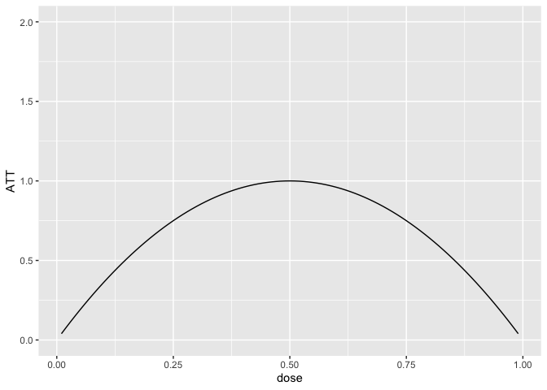
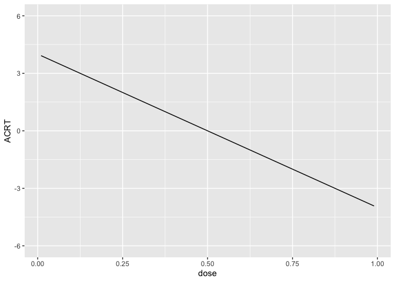
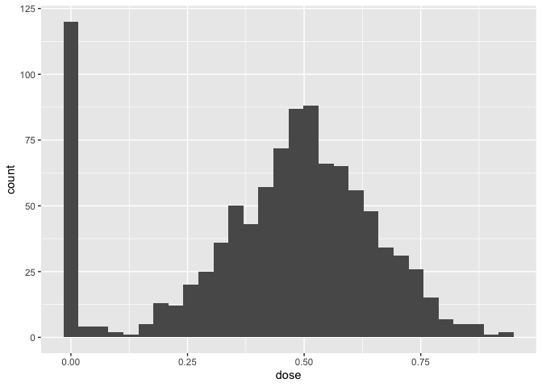
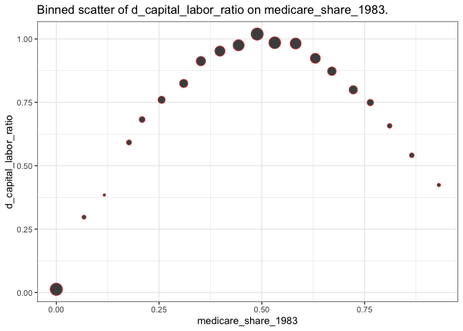
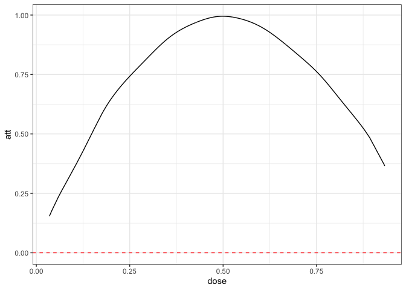
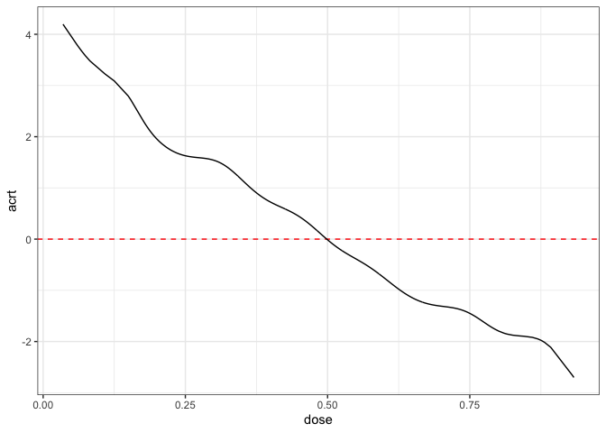
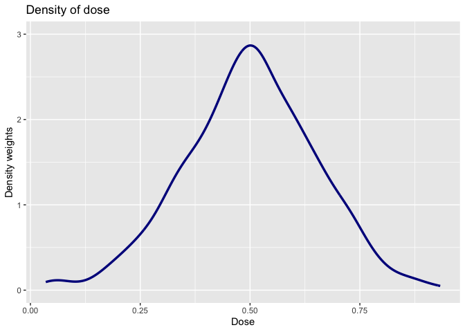
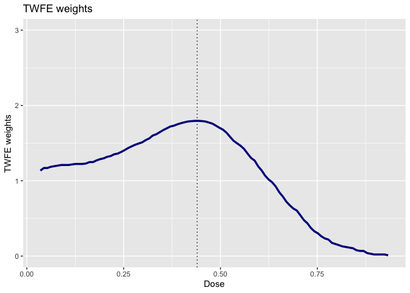

# Exercise 2a Solutions

For this problem, we are going to use a difference-in-differences
identification strategy to estimate the causal effect of a continuous
treatment. The data that I am providing below is simulated data, but it
has broadly similar features to the data used in the application in
Callaway, Goodman-Bacon, and Sant’Anna (2023) which comes from Acemoglu
and Finkelstein (2008) which considers the effect of a Medicare policy
in the 1980s that reduced reimbursement rates to hospitals specifically
for labor expenditures. The outcome variable is the capital-labor ratio,
and (roughly) the theoretical argument in their paper is that the policy
could alter the capital/labor mix in hospitals, and that these effects
could vary across hospitals that had differential exposure to the policy
(where exposure is based on the fraction of Medicare patients in the
period before the policy was implemented).

Here is information about installing and loading packages that could be
useful in this problem.

``` r
devtools::install_github("shommazumder/binscatteR")
```

``` r
library(ggplot2)
library(binscatteR)
library(np)
```

### Additional Code

I should mention that code for DID with a continuous treatment is not
nearly as well developed as some of the other cases that we have
considered previously. Therefore, I’m directly providing some functions
that you may find useful below. The first function computes weights from
a TWFE regression with a continuous treatment (these are the same
weights that we talked about in our session today).

``` r
#' @param l a particular value of the treatment for which to compute weights
#' @param D an nx1 vector containing doses for all units
cont_twfe_weights <- function(l, D) {
  wt <- ( ( mean(D[D>=l]) - mean(D) ) * mean(1*(D>=l)) ) / var(D)
  wt
}
```

The second function provides a way to nonparametrically estimate causal
effect parameters with a continuous treatment.

``` r
#' nonparametric estimates of att(d|d) and acrt(d|d)
#' @param dy the change in the outcome over time
#' @param dose the amount of the treatment
#' @return list( 
#'            local_effects - data frame containing the dose and estimates of 
#'              att(dose) and acrt(dose)
#'            att.overall - an estimate of the overall att
#'            acrt.overall - an estimate of the overall acrt
#'          )
cont_did <- function(dy, dose) {
  # choose bandwidth
  bw <- np::npregbw(formula=dy ~ dose,
                regtype="ll",
                bws=1.06,
                bwscaling=TRUE,
                bandwidth.compute=FALSE)
  # estimate att and acrt nonparametrically
  out <- np::npreg(bws=bw, gradients=TRUE, exdat=dose)

  # order from smallest to largest dose and drop untreated
  this_order <- order(dose)
  dose <- dose[this_order]
  dy <- dy[this_order]
  att.d <- out$mean[this_order]
  acrt.d <- out$grad[,1][this_order]
  att.d <- att.d[dose>0]
  acrt.d <- acrt.d[dose>0]
  att.overall <- mean(att.d)
  acrt.overall <- mean(acrt.d)
  
  return(list(local_effects=data.frame(dose=dose[dose>0],
                                       att.d=att.d,
                                       acrt.d=acrt.d),
              att.overall=att.overall,
              acrt.overall=acrt.overall))
}
```

### Data and Data Generating Process

You can load the data by running

``` r
load("medicare1.RData")
```

It contains the following columns:

-   `hospital_id` - the hospital identifier
-   `d_capital_labor_ratio` - the change in the capital labor ratio for
    a hospital from 1983 to 1985, this is the (change in the) outcome
    variable
-   `medicare_share_1983` - the fraction of medicare patients in the
    hospital in 1983, this is the continuous treatment variable.

Here are the first few rows of the data

``` r
head(medicare1)
```

      hospital_id d_capital_labor_ratio medicare_share_1983
    1           1             1.0801008           0.6575648
    2           2             0.7099469           0.3040419
    3           3             0.8776760           0.6135562
    4           4             0.9431500           0.4825248
    5           5             0.6435963           0.7852173
    6           6             0.9563133           0.4610489

Remember this is simulated data, so we can also go ahead and get a sense
of what the answers to the questions below “ought” to be (we will see
how well various approaches can deliver them below.)

To start with, I generated the data where $ATT(d|d)$ is given as in the
following plot:

``` r
dose <- seq(.01,.99,by=.01)
ATT <- -4*(dose-.5)^2 + 1
p <- ggplot(data.frame(ATT=ATT, dose=dose), aes(x=dose, y=ATT)) + 
    geom_line() + ylim(c(0,2))
p
```



And this implies that $ACRT(d|d)$ is as is given in the following plot:

``` r
ACRT <- -8*(dose-.5)
ggplot(data.frame(ACRT=ACRT, dose=dose), aes(x=dose, y=ACRT)) +
  geom_line() + ylim(c(-6,6))
```



I drew the data so that there is a 10% chance of a hospital being
untreated and then, among treated hospitals, I drew the dose from a
normal distribution with mean 0.5 and standard deviation of 0.16. Since
this is symmetric about 0.5, it implies that $ACRT^O=0$ by construction.
We will see how well we can replicate this using different approaches
below.

### Question 1

Plot a histogram of the the dose. What do you make of this?

<details>
<summary>
Solutions:
</summary>

<div style="border-left: 2px solid black; padding-left: 1rem">

``` r
dose <- medicare1$medicare_share_1983
dy <- medicare1$d_capital_labor_ratio


p <- ggplot(data.frame(dose=dose), aes(x=dose)) + 
     geom_histogram()
p
```

    `stat_bin()` using `bins = 30`. Pick better value with `binwidth`.



The histogram show that a non-trivial fraction of units are untreated
while common values of the treatment are around 0.5 and this decreases
as we move towards the 0 and 1. This is in line with the data generating
process described above.

</div>

</details>

### Question 2

Make a binscatter plot of the change in the outcome over time with
respect to the dose. What do you make of this?

<details>
<summary>
Solutions:
</summary>

<div style="border-left: 2px solid black; padding-left: 1rem">

``` r
binnedout <- binscatter(data=medicare1, x="medicare_share_1983", y="d_capital_labor_ratio")
binnedout
```

    $plot_out




    $binned_df
    # A tibble: 20 × 8
       xbinned   meanoutcome seoutcome      x lower_95 upper_95 sizebin outcomelabel
       <fct>           <dbl>     <dbl>  <dbl>    <dbl>    <dbl>   <int> <chr>       
     1 (-0.0009…      0.0128  0.000882 0        0.0111   0.0146     124 d_capital_l…
     2 (0.0466,…      0.297   0.0323   0.0673   0.234    0.361        5 d_capital_l…
     3 (0.0933,…      0.385   0.0544   0.117    0.278    0.491        2 d_capital_l…
     4 (0.14,0.…      0.592   0.0123   0.177    0.568    0.616       10 d_capital_l…
     5 (0.187,0…      0.682   0.00811  0.209    0.666    0.698       16 d_capital_l…
     6 (0.233,0…      0.760   0.00326  0.256    0.754    0.767       30 d_capital_l…
     7 (0.28,0.…      0.825   0.00237  0.310    0.820    0.829       44 d_capital_l…
     8 (0.327,0…      0.913   0.00177  0.352    0.909    0.916       61 d_capital_l…
     9 (0.373,0…      0.952   0.00138  0.398    0.950    0.955       76 d_capital_l…
    10 (0.42,0.…      0.975   0.00109  0.443    0.973    0.977       96 d_capital_l…
    11 (0.466,0…      1.02    0.000769 0.489    1.02     1.02       121 d_capital_l…
    12 (0.513,0…      0.985   0.000775 0.531    0.984    0.987      113 d_capital_l…
    13 (0.56,0.…      0.982   0.00115  0.582    0.980    0.984       94 d_capital_l…
    14 (0.606,0…      0.924   0.00154  0.630    0.921    0.927       74 d_capital_l…
    15 (0.653,0…      0.873   0.00210  0.670    0.869    0.877       49 d_capital_l…
    16 (0.7,0.7…      0.800   0.00271  0.722    0.794    0.805       45 d_capital_l…
    17 (0.746,0…      0.749   0.00581  0.764    0.738    0.761       21 d_capital_l…
    18 (0.793,0…      0.657   0.00899  0.811    0.640    0.675        8 d_capital_l…
    19 (0.84,0.…      0.541   0.0178   0.865    0.506    0.576        8 d_capital_l…
    20 (0.886,0…      0.424   0.0528   0.931    0.320    0.528        3 d_capital_l…

This picture is closely related to the plot of $ATT(d|d)$ provided
earlier. The size of the dots also reflects the distribution of the dose
that was discussed in Question 1.

</div>

</details>

### Question 3

Run a regression of the change in the outcome over time on the dose.
What do you make of the results?

<details>
<summary>
Solutions:
</summary>

<div style="border-left: 2px solid black; padding-left: 1rem">

``` r
twfe <- lm(dy ~ dose)
summary(twfe)$coefficients
```

                 Estimate Std. Error  t value      Pr(>|t|)
    (Intercept) 0.3273579 0.01715088 19.08695  1.776977e-69
    dose        1.0794670 0.03501614 30.82770 3.804918e-147

If we were hoping to estimate $ACRT^O$, then we did not do it well here:
recall that $ACRT^O=0$, but here the coefficient on the dose is 1.08 and
strongly statistically different from 0.

</div>

</details>

### Question 4

Use the `cont_did` function provided above to estimate the $ATT(d|d)$,
$ACRT(d|d)$, $ATT$, and $ACRT^O$. Plot $ATT(d|d)$ and $ACRT(d|d)$ as
functions of the dose and provide estimates of $ATT$ and $ACRT^O$.

<details>
<summary>
Solutions:
</summary>

<div style="border-left: 2px solid black; padding-left: 1rem">

``` r
cont_res <- cont_did(dy, dose)
cont_res$att.overall
```

    [1] 0.9032416

``` r
cont_res$acrt.overall
```

    [1] 0.04110219

``` r
plot_df <- cont_res$local_effects

colnames(plot_df) <- c("dose", "att", "acrt")
ggplot(plot_df, aes(x=dose, att)) +
  geom_hline(yintercept=0, color="red", linetype="dashed") +
  geom_line() +
  theme_bw()
```



``` r
ggplot(plot_df, aes(x=dose, acrt)) +
  geom_hline(yintercept=0, color="red", linetype="dashed") +
  geom_line() +
  theme_bw()
```



These estimates are in line with the data generating process that we
described above. Note also that `acrt.overall` is much closer to 0 than
what we got with the TWFE regression.

</div>

</details>

### Question 5

The following plot provide an estimate of the density of the dose. How
is this plot related to the estimate of $ACRT^O$ from Question 4?

<details>
<summary>
Solutions:
</summary>

<div style="border-left: 2px solid black; padding-left: 1rem">

``` r
#-----------------------------------------------------------------------------
dL <- min(dose[dose>0])
dU <- max(dose)
# density of the dose
dose_grid <- seq(dL, dU, length.out=100)
frq_weights_plot <- ggplot(data.frame(dose=dose[dose>0]), aes(x=dose)) +
  geom_density(colour = "darkblue", linewidth = 1.2) +
  xlim(c(min(dose_grid), max(dose_grid)))+
  ylab("Density weights") +
  xlab("Dose") +
  ylim(c(0,3)) + 
  labs(title="Density of dose")
frq_weights_plot
```



The density of the dose effectively serves as the weights on $ACRT(d|d)$
to deliver an estimate of $ACRT^O$. Here you can see that values of the
dose near 0.5 get the most weights — this makes sense as these doses
around 0.5 are more common than doses closer to 0 or 1.

</div>

</details>

### Question 6

Use the function `cont_twfe_weights` provided above to create a plot of
the TWFE weights as a function of the dose. How is this plot related to
the result from Question 3?

<details>
<summary>
Solutions:
</summary>

<div style="border-left: 2px solid black; padding-left: 1rem">

``` r
twfe_weights <- sapply(dose_grid, cont_twfe_weights, D=dose)

plot_df <- cbind.data.frame(twfe_weights, dose_grid)
  
twfe_weights_plot <- ggplot(data=plot_df,
                            mapping=aes(x = dose_grid,
                                        y = twfe_weights)) +
  geom_line(colour = "darkblue", linewidth = 1.2) +
  xlim(c(min(dose_grid),
         max(dose_grid)))+
  ylab("TWFE weights") +
  xlab("Dose") +
  geom_vline(xintercept = mean(dose),
             colour="black",
             linewidth = 0.5,
             linetype = "dotted") +
  ylim(c(0,3)) +
  labs(title="TWFE weights")

twfe_weights_plot
```



These weights explain why we get so much different results from the TWFE
regression relative to the nonparametric approach. The TWFE regression
puts substantially more weight on low values of the dose. We know that
the $ACRT(d|d)$ was larger for small values of the dose. Therefore, if
we put more weight on those values of the dose, then we will get a
larger estimate of the summary measure — this is exactly what is
happening with the TWFE regression.

</div>

</details>
