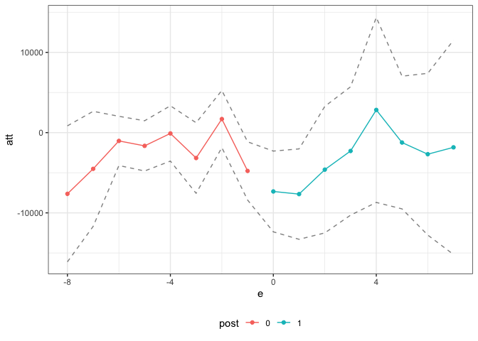
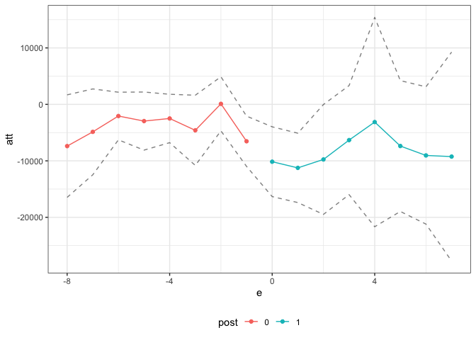
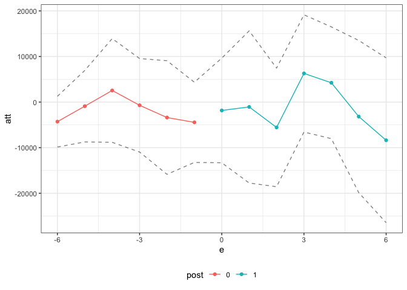

# Exercise 2b Solutions

For this exercise, we will revisit the job displacement example from
Exercise 1, but we will try out some alternative identification
strategies: (i) change-in-changes, (ii) conditioning on lagged outcomes,
and (iii) interactive fixed effects.

To start with, load the data from the file `job_displacement_data.RData`
by running

``` r
load("job_displacement_data.RData")
```

which will load a `data.frame` called `job_displacement_data`. This is
what the data looks like

``` r
head(job_displacement_data)
```

           id year group income female white occ_score
    1 7900002 1984     0  31130      1     1         4
    2 7900002 1985     0  32200      1     1         3
    3 7900002 1986     0  35520      1     1         4
    4 7900002 1987     0  43600      1     1         4
    5 7900002 1988     0  39900      1     1         4
    6 7900002 1990     0  38200      1     1         4

You can see that the data contains the following columns:

-   `id` - an individual identifier
-   `year` - the year for this observation
-   `group` - the year that person lost his/her job. `group=0` for those
    that do not lose a job in any period being considered.
-   `income` - a person’s wage and salary income in this year
-   `female` - 1 for females, 0 for males
-   `white` - 1 for white, 0 for non-white

For the results below, we will mainly use the `qte`, `pte`, and `ife`
packages. `pte` and `ife` in particular are new packages, so we will
download the newest versions of these from GitHub. We will also need the
`BMisc` and `dplyr` packages.

``` r
devtools::install_github("bcallaway11/qte")
devtools::install_github("bcallaway11/pte")
devtools::install_github("bcallaway11/ife")
devtools::install_github("bcallaway11/BMisc")
install.packages("dplyr")
```

and then the packages can be loaded by

``` r
library(qte) # for change-in-changes
library(pte) # for lagged outcomes
library(ife) # for interactive fixed effects
library(BMisc)
library(dplyr)
```

Below, we will basically try to replicate Question 1 from Exercise 1,
but use alternative identification strategies.

## Question 1 — change-in-changes

Use the `qte` package to compute all available group-time average
treatment effects, an event study, and an overall average treatment
effect. The function that can deal with multiple periods and variation
in treatment timing is called `cic2`. In the results below, I also allow
for one year of anticipation based on our discussion in the previous
exercise.

<details>
<summary>
Solutions:
</summary>

<div style="border-left: 2px solid black; padding-left: 1rem">

``` r
set.seed(1234)
cic_res <- cic2(yname="income",
                tname="year",
                idname="id",
                gname="group",
                data=job_displacement_data,
                cl=4, # inference uses bootstrap, so using 4 cores here for parallel computing
                anticipation=1)
# show group-time average treatment effects
cic_res$attgt_results
```

       group         att time.period        se
    1   1986  -4845.7935        1985  2941.485
    2   1986  -4752.4000        1987  4268.595
    3   1986  -6625.1532        1990  3989.792
    4   1986  -6403.9360        1992  6475.012
    5   1986  -3794.0000        1988  6311.128
    6   1986  -6569.0401        1991  7553.531
    7   1986  -1834.2997        1993  7848.916
    8   1986  -4469.6000        1986  6812.426
    9   1987   3761.9200        1992  5154.603
    10  1987  -7235.1818        1986  5213.187
    11  1987   3402.5364        1985  6392.746
    12  1987   2375.2091        1993  8047.834
    13  1987   2315.9617        1990  6568.586
    14  1987  -2874.9000        1988  6838.578
    15  1987   -709.2931        1987  9429.856
    16  1987   4009.0909        1991  7180.630
    17  1988  12739.4219        1992  4555.255
    18  1988    689.6769        1993  2887.785
    19  1988  -1698.1369        1990  4076.565
    20  1988   4747.9847        1991  4506.070
    21  1988  -4678.6154        1987  6874.364
    22  1988  -2691.3230        1986  5974.993
    23  1988  -8671.0000        1985 15079.435
    24  1988  -4931.4462        1988  6693.309
    25  1990 -13126.6667        1992  2978.929
    26  1990  -2238.6797        1990  2376.596
    27  1990 -14135.7833        1993  3524.863
    28  1990   4991.8367        1987  3203.590
    29  1990 -18937.5000        1991  6665.528
    30  1990  -6233.7668        1985  5373.562
    31  1990   1225.0000        1988  5589.603
    32  1990   5050.5000        1986  6764.725
    33  1991   3356.1089        1990  2691.714
    34  1991   1885.5127        1993  3434.571
    35  1991   6171.4399        1992  3443.967
    36  1991  -8032.5000        1991  3613.092
    37  1991  -2445.6875        1987  6172.713
    38  1991  -6773.8125        1988  7920.642
    39  1991   -526.9875        1985  7860.285
    40  1991  -1928.6250        1986 10264.553
    41  1992   1389.7500        1987  5269.673
    42  1992 -10590.0000        1991  2499.366
    43  1992   7385.3333        1990  4240.734
    44  1992  -7276.1501        1988  2783.236
    45  1992 -10431.6506        1985  5033.163
    46  1992 -19606.6667        1993  8989.598
    47  1992 -19610.8001        1992  8182.393
    48  1992  -3480.9600        1986  9406.849
    49  1993  -5307.8665        1992  4322.829
    50  1993  -7628.3333        1985  3233.505
    51  1993    740.1100        1987  3375.391
    52  1993  -2749.7637        1990  1914.297
    53  1993   1406.0000        1986  5040.973
    54  1993   4847.1504        1988  4953.218
    55  1993   3312.6003        1991  4837.222
    56  1993 -28808.7669        1993  5731.328

``` r
# recover event study and overall average treatment effect
summary(cic_res)
```


    Overall ATT:  
           ATT    Std. Error     [ 95%  Conf. Int.]  
     -6524.985      2564.742  -11551.79   -1498.183 *


    Dynamic Effects:
     Event Time   Estimate Std. Error [95% Pointwise  Conf. Band]  
             -8 -7628.3333   4322.828      -16100.922    844.2549  
             -7 -4512.8253   3657.676      -11681.739   2656.0888  
             -6 -1033.0500   1564.448       -4099.312   2033.2123  
             -5 -1650.4000   1597.223       -4780.899   1480.0989  
             -4  -100.6308   1757.944       -3546.138   3344.8763  
             -3 -3166.9242   2243.394       -7563.895   1230.0465  
             -2  1694.3396   1817.471       -1867.839   5256.5179  
             -1 -4773.4615   1850.758       -8400.881  -1146.0418 *
              0 -7332.3463   2567.500      -12364.554  -2300.1386 *
              1 -7662.0842   2873.928      -13294.879  -2029.2890 *
              2 -4612.9516   4023.412      -12498.695   3272.7918  
              3 -2289.7228   4080.879      -10288.098   5708.6529  
              4  2829.1073   5881.593       -8698.604  14356.8183  
              5 -1235.6072   4218.690       -9504.088   7032.8731  
              6 -2689.6823   5141.471      -12766.781   7387.4167  
              7 -1834.2997   6812.426      -15186.410  11517.8108  
    ---
    Signif. codes: `*' confidence band does not cover 0

``` r
# plot event study
ggpte(cic_res)
```



</div>

</details>

## Question 2 — lagged outcome

Use the `pte` package to compute all available group-time average
treatment effects, an event study, and an overall average treatment
effect. The function `pte_default` can allow for conditioning on lagged
outcomes (it can also allow for a number of other extensions as well —
see documentation) In the results below, I also allow for one year of
anticipation based on our discussion in the previous exercise.

<details>
<summary>
Solutions:
</summary>

<div style="border-left: 2px solid black; padding-left: 1rem">

``` r
set.seed(1234)
lo_res <- pte_default(yname="income",
                      tname="year",
                      idname="id",
                      gname="group",
                      lagged_outcome_cov = TRUE, # this includes lagged outcome
                      data=job_displacement_data,
                      anticipation=1)

# show group-time average treatment effects
lo_res$att_gt
```

    Group-Time Average Treatment Effects:
     Group Time    ATT(g,t) Std. Error       [95%  Conf. Band]  
      1986 1985  -5437.7291   2539.687 -11963.2100   1087.7519  
      1986 1986  -8184.0510   2845.742 -15495.9108   -872.1911 *
      1986 1987  -9568.2759   3477.630 -18503.7116   -632.8402 *
      1986 1988  -9532.2989   5937.165 -24787.2735   5722.6756  
      1986 1990 -13180.6460   5858.425 -28233.3041   1872.0120  
      1986 1991 -13257.0049   5900.434 -28417.6024   1903.5927  
      1986 1992 -14269.2795   6167.789 -30116.8207   1578.2617  
      1986 1993  -9245.4677   6282.396 -25387.4792   6896.5438  
      1987 1985   1192.3065   4694.315 -10869.2835  13253.8965  
      1987 1986  -9260.7781   4299.861 -20308.8587   1787.3025  
      1987 1987  -2863.2089   6583.287 -19778.3312  14051.9133  
      1987 1988  -5588.5495   7180.710 -24038.6937  12861.5948  
      1987 1990  -1706.6989   6151.739 -17512.9990  14099.6013  
      1987 1991    -72.4853   6916.690 -17844.2554  17699.2847  
      1987 1992  -1199.0628   9131.848 -24662.4682  22264.3426  
      1987 1993  -1918.6063   6994.201 -19889.5327  16052.3201  
      1988 1985  -8973.0277   3532.817 -18050.2609    104.2056  
      1988 1986  -5272.6276   3451.823 -14141.7551   3596.4999  
      1988 1987  -6924.2880   3586.878 -16140.4247   2291.8487  
      1988 1988  -9252.7374   4054.985 -19671.6320   1166.1571  
      1988 1990  -7454.3634   6958.487 -25333.5271  10424.8003  
      1988 1991  -1290.2248   5250.044 -14779.7087  12199.2591  
      1988 1992   5882.6327  15068.454 -32834.3102  44599.5757  
      1988 1993  -5823.3262   6939.620 -23654.0121  12007.3596  
      1990 1985  -7297.1361   2442.898 -13573.9285  -1020.3437 *
      1990 1986   1422.4305   2847.899  -5894.9714   8739.8325  
      1990 1987   3846.0500   2648.511  -2959.0449  10651.1449  
      1990 1988    493.6461   2853.633  -6838.4886   7825.7808  
      1990 1990  -3832.7323  10038.474 -29625.6262  21960.1616  
      1990 1991 -21324.3552   5002.298 -34177.2794  -8471.4311 *
      1990 1992 -14880.1044   4554.805 -26583.2375  -3176.9712 *
      1990 1993 -16015.5653   5987.320 -31399.4085   -631.7221 *
      1991 1985  -2464.0434   2780.923  -9609.3582   4681.2714  
      1991 1986  -4720.1331   3359.358 -13351.6801   3911.4138  
      1991 1987  -4554.0573   2316.128 -10505.1254   1397.0109  
      1991 1988 -10559.0222   4336.586 -21701.4634    583.4191  
      1991 1990  -3071.6577   4237.070 -13958.4018   7815.0863  
      1991 1991 -15132.5924   6397.662 -31570.7685   1305.5836  
      1991 1992  -1169.1505   6231.022 -17179.1613  14840.8602  
      1991 1993  -6224.2234   8501.978 -28069.2393  15620.7924  
      1992 1985  -9274.3763   4964.768 -22030.8694   3482.1168  
      1992 1986  -3329.6311   3453.564 -12203.2323   5543.9701  
      1992 1987   1269.4440   3896.118  -8741.2575  11280.1454  
      1992 1988  -7588.5682   3002.123 -15302.2355    125.0991  
      1992 1990   5822.0112   4000.061  -4455.7597  16099.7821  
      1992 1991 -10262.8009   6820.974 -27788.6376   7263.0359  
      1992 1992 -19290.9447   5884.011 -34409.3454  -4172.5441 *
      1992 1993 -19094.2022   8298.266 -40415.7996   2227.3952  
      1993 1985  -7392.7569   3665.678 -16811.3646   2025.8508  
      1993 1986   -460.2022   2305.565  -6384.1307   5463.7262  
      1993 1987   -259.0623   3176.464  -8420.6818   7902.5572  
      1993 1988   3848.0576   1322.586    449.8001   7246.3151 *
      1993 1990  -4026.8071   3840.596 -13894.8499   5841.2356  
      1993 1991   3188.1070   6301.565 -13003.1579  19379.3720  
      1993 1992  -4324.1541   5063.287 -17333.7831   8685.4749  
      1993 1993 -27247.1428   4884.852 -39798.3001 -14695.9855 *
    ---
    Signif. codes: `*' confidence band does not cover 0

    P-value for pre-test of parallel trends assumption:  0

``` r
# recover event study and overall average treatment effect
summary(lo_res)
```


    Overall ATT:  
           ATT    Std. Error     [ 95%  Conf. Int.]  
     -10471.62      1971.321  -14335.34   -6607.901 *


    Dynamic Effects:
     Event Time    Estimate Std. Error      [95%  Conf. Band]  
             -8  -7392.7569   3346.800 -16471.888   1686.3744  
             -7  -4867.2893   2802.143 -12468.887   2734.3080  
             -6  -2062.2254   1555.473  -6281.881   2157.4297  
             -5  -2956.9278   1896.044  -8100.479   2186.6235  
             -4  -2495.9500   1579.505  -6780.799   1788.8991  
             -3  -4593.0713   2290.912 -10807.811   1621.6684  
             -2     94.9099   1765.506  -4694.518   4884.3380  
             -1  -6534.6649   1641.262 -10987.048  -2082.2818 *
              0 -10152.4465   2277.186 -16329.952  -3974.9406 *
              1 -11246.3243   2264.317 -17388.919  -5103.7296 *
              2  -9755.1302   3586.519 -19484.569    -25.6919 *
              3  -6325.9276   3559.751 -15982.750   3330.8950  
              4  -3129.0463   6833.785 -21667.601  15409.5080  
              5  -7378.1540   4270.532 -18963.169   4206.8609  
              6  -9043.9947   4481.832 -21202.219   3114.2301  
              7  -9245.4677   6820.317 -27747.487   9256.5518  
    ---
    Signif. codes: `*' confidence band does not cover 0

``` r
# plot event study
ggpte(lo_res)
```



</div>

</details>

## Question 3 — interactive fixed effects

Use the `ife` package to compute all available group-time average
treatment effects, an event study, and an overall average treatment
effect. The function that can deal with multiple periods and variation
in treatment timing is called `staggered_ife2` — this function will use
the groups to identify causal effect parameters and does not require us
to specify additional instruments. We will allow for one interactive
fixed effect, by setting `nife=1`, but you can try other values. `ife`
does not currently support allowing for anticipation, so we will remove
it for these results.

<details>
<summary>
Solutions:
</summary>

<div style="border-left: 2px solid black; padding-left: 1rem">

``` r
set.seed(1234)
ife_res <- staggered_ife2(yname="income",
                          tname="year",
                          idname="id",
                          gname="group",
                          data=job_displacement_data,
                          anticipation=0,
                          nife=1)
# show group-time average treatment effects
ife_res$att_gt
```

    Group-Time Average Treatment Effects:
     Group Time    ATT(g,t) Std. Error      [95%  Conf. Band]  
      1986 1986  -2185.8205   3548.027 -11217.605   6845.9637  
      1987 1986  -8584.2103   4317.306 -19574.256   2405.8351  
      1988 1986 -11155.7720   7269.968 -29662.054   7350.5103  
      1990 1986   3055.6419   2387.082  -3020.864   9132.1482  
      1991 1986  -2584.2968   3269.108 -10906.072   5737.4784  
      1992 1986  -4295.1733   1943.968  -9243.698    653.3518  
      1986 1987   -511.8414   4455.616 -11853.967  10830.2840  
      1987 1987  16744.4845   8939.788  -6012.457  39501.4263  
      1988 1987  -3152.4261   5076.839 -16075.923   9771.0712  
      1990 1987   1446.0858   4381.904  -9708.399  12600.5707  
      1991 1987   2043.8396   5818.797 -12768.370  16856.0493  
      1992 1987   1351.7783   6667.762 -15621.541  18325.0978  
      1986 1988   -228.2963   9291.832 -23881.394  23424.8013  
      1987 1988  20819.5901  18274.007 -25698.350  67337.5305  
      1988 1988  -2912.4569  12536.392 -34824.840  28999.9261  
      1990 1988   3031.9369  11204.727 -25490.588  31554.4617  
      1991 1988  -3928.9605   7678.212 -23474.460  15616.5391  
      1992 1988   2216.2118  17241.149 -41672.505  46104.9289  
      1986 1990  -5053.8696   7671.814 -24583.082  14475.3423  
      1987 1990   3895.8557   6055.372 -11518.575  19310.2866  
      1988 1990     29.7978   6865.788 -17447.612  17507.2079  
      1990 1990  -6180.2416  17225.613 -50029.412  37668.9289  
      1991 1990   -524.9309  11388.165 -29514.412  28464.5501  
      1992 1990    591.5856  13463.892 -33681.822  34864.9937  
      1986 1991 -11866.8683   7291.637 -30428.312   6694.5754  
      1987 1991   5756.9310  10013.855 -19734.134  31247.9964  
      1988 1991   8313.5065   8278.234 -12759.397  29386.4096  
      1990 1991 -23029.5600   5227.156 -36335.701  -9723.4193 *
      1991 1991  -6961.8284   9789.606 -31882.049  17958.3921  
      1992 1991  -4870.8800   8217.496 -25789.171  16047.4112  
      1986 1992  -8375.7485   7223.553 -26763.879  10012.3821  
      1987 1992   8672.0499  10256.302 -17436.184  34780.2839  
      1988 1992  13674.6668  13087.883 -19641.581  46990.9147  
      1990 1992 -18280.0333  12195.632 -49324.986  12764.9192  
      1991 1992    763.0713   4603.006 -10954.247  12480.3896  
      1992 1992 -17172.7550   5110.529 -30182.013  -4163.4966 *
    ---
    Signif. codes: `*' confidence band does not cover 0

    P-value for pre-test of parallel trends assumption:  3e-05

``` r
# recover event study and overall average treatment effect
summary(ife_res)
```


    Overall ATT:  
           ATT    Std. Error     [ 95%  Conf. Int.] 
     -3127.669      2422.695  -7876.065    1620.727 


    Dynamic Effects:
     Event Time   Estimate Std. Error      [95%  Conf. Band] 
             -6 -4295.1733   2177.581  -9858.743    1268.397 
             -5  -897.4075   3070.450  -8742.195    6947.381 
             -4  2550.6035   4452.903  -8826.259   13927.466 
             -3  -703.9327   4013.686 -10958.624    9550.759 
             -2 -3390.0735   4877.994 -15853.013    9072.866 
             -1 -4442.9626   3442.378 -13238.004    4352.078 
              0 -1836.2150   4493.368 -13316.462    9644.032 
              1 -1063.3104   6530.672 -17748.729   15622.108 
              2 -5559.9368   5091.257 -18567.750    7447.876 
              3  6288.7499   5031.763  -6567.060   19144.559 
              4  4238.1760   4798.021  -8020.440   16496.792 
              5 -3177.3260   6535.017 -19873.847   13519.195 
              6 -8375.7485   7074.927 -26451.702    9700.205 
    ---
    Signif. codes: `*' confidence band does not cover 0

``` r
# plot event study
ggpte(ife_res)
```



</div>

</details>

# Question 4

What do you make of the results in this excercise relative to each other
and relative to the previous results from Exercise 1 that used
difference-in-differences?

<details>
<summary>
Solutions:
</summary>

<div style="border-left: 2px solid black; padding-left: 1rem">

To me, the results look pretty similar for difference-in-differences,
change-in-changes, and unconfoundedness conditional on the lagged
outcome. For the event study, in pre-treatment periods, they all deliver
non-statistically significant effects in pre-treatment periods (though
some of the results still seem fairly large in magnitude; also, if you
look at the group-time average treatment effects, then there are some
apparent violations of parallel trends in pre-treatment periods) and
then indicate a statistically significant drop in income in the two or
three years following job displacement. For interactive fixed effects,
the estimates themselves in pre-treatment periods seem to be at least as
close to 0 as for the other approaches though, in this application,
there appears to be sharp price to pay in terms of larger standard
errors.

</div>

</details>
