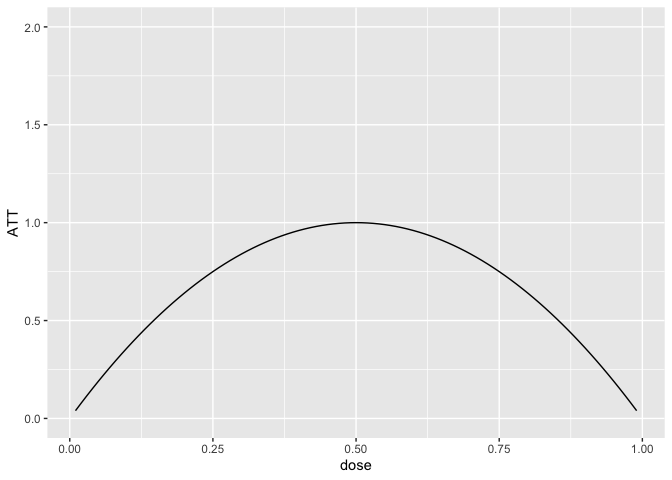
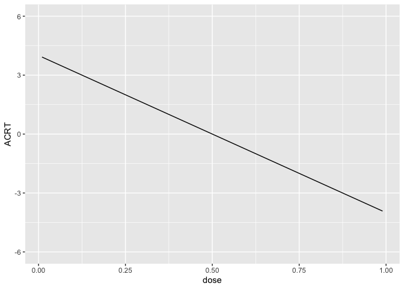

# Exercise 2a

For this problem, we are going to use a difference-in-differences
identification strategy to estimate the causal effect of a continuous
treatment. The data that I am providing below is simulated data, but it
has broadly similar features to the data used in the application in
Callaway, Goodman-Bacon, and Sant’Anna (2023) which comes from Acemoglu
and Finkelstein (2008) which considers the effect of a Medicare policy
in the 1980s that reduced reimbursement rates to hospitals specifically
for labor expenditures. The outcome variable is the capital-labor ratio,
and (roughly) the theoretical argument in their paper is that the policy
could alter the capital/labor mix in hospitals, and that these effects
could vary across hospitals that had differential exposure to the policy
(where exposure is based on the fraction of Medicare patients in the
period before the policy was implemented).

Here is information about installing and loading packages that could be
useful in this problem.

``` r
devtools::install_github("shommazumder/binscatteR")
```

``` r
library(ggplot2)
library(binscatteR)
library(np)
```

### Additional Code

I should mention that code for DID with a continuous treatment is not
nearly as well developed as some of the other cases that we have
considered previously. Therefore, I’m directly providing some functions
that you may find useful below. The first function computes weights from
a TWFE regression with a continuous treatment (these are the same
weights that we talked about in our session today).

``` r
#' @param l a particular value of the treatment for which to compute weights
#' @param D an nx1 vector containing doses for all units
cont_twfe_weights <- function(l, D) {
  wt <- ( ( mean(D[D>=l]) - mean(D) ) * mean(1*(D>=l)) ) / var(D)
  wt
}
```

The second function provides a way to nonparametrically estimate causal
effect parameters with a continuous treatment.

``` r
#' nonparametric estimates of att(d|d) and acrt(d|d)
#' @param dy the change in the outcome over time
#' @param dose the amount of the treatment
#' @return list( 
#'            local_effects - data frame containing the dose and estimates of 
#'              att(dose) and acrt(dose)
#'            att.overall - an estimate of the overall att
#'            acrt.overall - an estimate of the overall acrt
#'          )
cont_did <- function(dy, dose) {
  # choose bandwidth
  bw <- np::npregbw(formula=dy ~ dose,
                regtype="ll",
                bws=1.06,
                bwscaling=TRUE,
                bandwidth.compute=FALSE)
  # estimate att and acrt nonparametrically
  out <- np::npreg(bws=bw, gradients=TRUE, exdat=dose)

  # order from smallest to largest dose and drop untreated
  this_order <- order(dose)
  dose <- dose[this_order]
  dy <- dy[this_order]
  att.d <- out$mean[this_order]
  acrt.d <- out$grad[,1][this_order]
  att.d <- att.d[dose>0]
  acrt.d <- acrt.d[dose>0]
  att.overall <- mean(att.d)
  acrt.overall <- mean(acrt.d)
  
  return(list(local_effects=data.frame(dose=dose[dose>0],
                                       att.d=att.d,
                                       acrt.d=acrt.d),
              att.overall=att.overall,
              acrt.overall=acrt.overall))
}
```

### Data and Data Generating Process

You can load the data by running

``` r
load("medicare1.RData")
```

It contains the following columns:

-   `hospital_id` - the hospital identifier
-   `d_capital_labor_ratio` - the change in the capital labor ratio for
    a hospital from 1983 to 1985, this is the (change in the) outcome
    variable
-   `medicare_share_1983` - the fraction of medicare patients in the
    hospital in 1983, this is the continuous treatment variable.

Here are the first few rows of the data

``` r
head(medicare1)
```

      hospital_id d_capital_labor_ratio medicare_share_1983
    1           1             1.0801008           0.6575648
    2           2             0.7099469           0.3040419
    3           3             0.8776760           0.6135562
    4           4             0.9431500           0.4825248
    5           5             0.6435963           0.7852173
    6           6             0.9563133           0.4610489

Remember this is simulated data, so we can also go ahead and get a sense
of what the answers to the questions below “ought” to be (we will see
how well various approaches can deliver them below.)

To start with, I generated the data where $ATT(d|d)$ is given as in the
following plot:

``` r
dose <- seq(.01,.99,by=.01)
ATT <- -4*(dose-.5)^2 + 1
p <- ggplot(data.frame(ATT=ATT, dose=dose), aes(x=dose, y=ATT)) + 
    geom_line() + ylim(c(0,2))
p
```



And this implies that $ACRT(d|d)$ is as is given in the following plot:

``` r
ACRT <- -8*(dose-.5)
ggplot(data.frame(ACRT=ACRT, dose=dose), aes(x=dose, y=ACRT)) +
  geom_line() + ylim(c(-6,6))
```



I drew the data so that there is a 10% chance of a hospital being
untreated and then, among treated hospitals, I drew the dose from a
normal distribution with mean 0.5 and standard deviation of 0.16. Since
this is symmetric about 0.5, it implies that $ACRT^O=0$ by construction.
We will see how well we can replicate this using different approaches
below.

### Question 1

Plot a histogram of the the dose. What do you make of this?

<div style="display: none;">

</div>

### Question 2

Make a binscatter plot of the change in the outcome over time with
respect to the dose. What do you make of this?

<div style="display: none;">

</div>

### Question 3

Run a regression of the change in the outcome over time on the dose.
What do you make of the results?

<div style="display: none;">

</div>

### Question 4

Use the `cont_did` function provided above to estimate the $ATT(d|d)$,
$ACRT(d|d)$, $ATT$, and $ACRT^O$. Plot $ATT(d|d)$ and $ACRT(d|d)$ as
functions of the dose and provide estimates of $ATT$ and $ACRT^O$.

<div style="display: none;">

</div>

### Question 5

The following plot provide an estimate of the density of the dose. How
is this plot related to the estimate of $ACRT^O$ from Question 4?

<div style="display: none;">

</div>

### Question 6

Use the function `cont_twfe_weights` provided above to create a plot of
the TWFE weights as a function of the dose. How is this plot related to
the result from Question 3?

<div style="display: none;">

</div>
