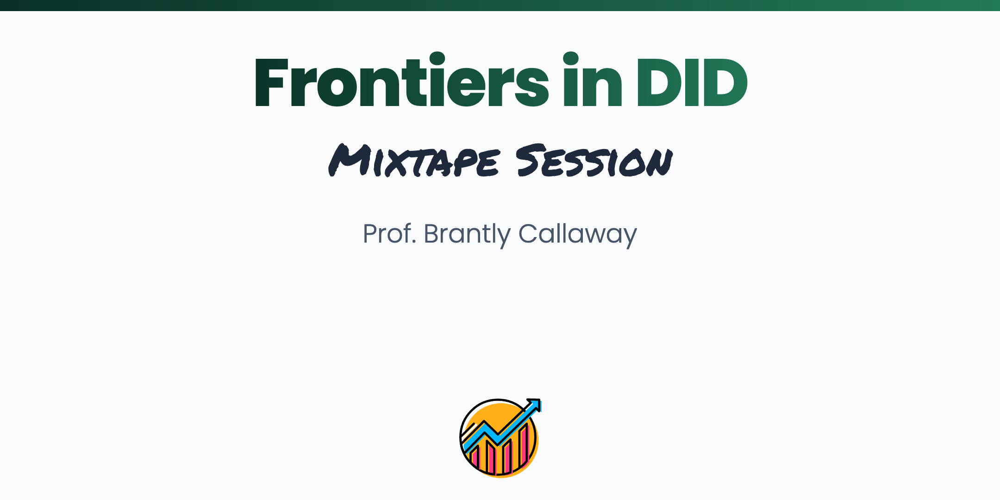

 
 

## About

This course provides an in-depth introduction to panel data approaches to causal inference. The first part of the course reviews how new "heterogeneity-robust" estimation strategies address some important limitations of traditional two-way fixed effects regressions in difference-in-differences applications, and then provides an in-depth discussion/comparison of many of these approaches. This part also includes a number of practical extensions such as how to include covariates in the parallel trends assumption and dealing with "bad controls". The second part of the course discusses how the insights of recent work on difference-in-differences can apply in a number of other settings that frequently arise in empirical work. And, in particular, this part of the course provides connections between the difference-in-differences literature and alternative identification strategies (conditioning on lagged outcomes, change-in-changes, and interactive fixed effects models) and also how to deal with more complicated treatment regimes (continuous treatments or treatments that can change value over time).

This is one of our advanced courses. These courses are designed <strong>assuming a solid foundation in the basics of the difference-in-differences methodology</strong> and will cover the frontiers of the topic. A good review is: https://github.com/Mixtape-Sessions/Causal-Inference-2.

 

## Schedule

<b>Introduction</b>
 

<b>About</b>

High-level discussion about using panel data for causal inference and an introduction/review of DID approaches

<b>Slides</b>

[Slides](https://mixtape-sessions.github.io/Frontiers-in-DID/Slides/DID-Introduction.html)

[Data](https://mixtape-sessions.github.io/Frontiers-in-DID/apm.RData)

<b>Relaxing Parallel Trends (& Covariates Good and Bad)</b>
 

<b>About</b>

Relaxing the parallel trends assumption by conditioning on covariates and dealing with covariates that could have been affected by the treatment

<b>Slides</b>

[Slides](https://mixtape-sessions.github.io/Frontiers-in-DID/Slides/Relaxing-Parallel-Trends.html)

<b>Coding Exercises</b>

[Exercise 1](https://mixtape-sessions.github.io/Frontiers-in-DID/Exercises/Exercise-1/exercise1.html)

[Data](https://mixtape-sessions.github.io/Frontiers-in-DID/Exercises/Exercise-1/job_displacement_data.RData)

[Solutions](https://mixtape-sessions.github.io/Frontiers-in-DID/Exercises/Exercise-1/exercise1_sol.html)

 

<b>More Complicated Treatment Regimes (or, I have a complicated treatment, what now?)</b>
 

<b>About</b>

Continuous treatment and a treatment that can turn on and off plus a high-level discussion of how to adapt "heterogeneity robust" strategies to new empirical settings

<b>Slides</b>

[Slides](https://mixtape-sessions.github.io/Frontiers-in-DID/Slides/More-Complicated-Treatment-Regimes.html)

<b>Coding Exercises</b>

[Exercise 2a](https://mixtape-sessions.github.io/Frontiers-in-DID/Exercises/Exercise-2/exercise2a.html)

[Data](https://mixtape-sessions.github.io/Frontiers-in-DID/Exercises/Exercise-2/medicare1.RData)

[Solutions](https://mixtape-sessions.github.io/Frontiers-in-DID/Exercises/Exercise-2/exercise2a_sol.html)

 

<b>Alternative Identification Strategies</b>
 

<b>About</b>

Many recent developments in panel data approaches to causal inference have come in the context of difference-in-differences, but many of these insights extend (in a straighforward way) to other using other identification strategies as well.  This part will consider changes-in-changes, interactive fixed effects models, and conditioning on lagged outcomes as alternative under-the-hood identification strategies.

<b>Slides</b>

[Slides](https://mixtape-sessions.github.io/Frontiers-in-DID/Slides/Alternative-Identification-Strategies.html)

<b>Coding Exercises</b>

[Exercise 2b](https://mixtape-sessions.github.io/Frontiers-in-DID/Exercises/Exercise-2/exercise2b.html)

Data Same as Exercise 1

[Solutions](https://mixtape-sessions.github.io/Frontiers-in-DID/Exercises/Exercise-2/exercise2b_sol.html)

 

